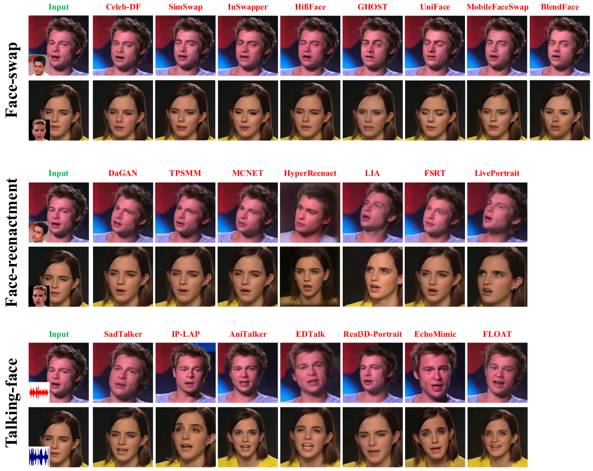
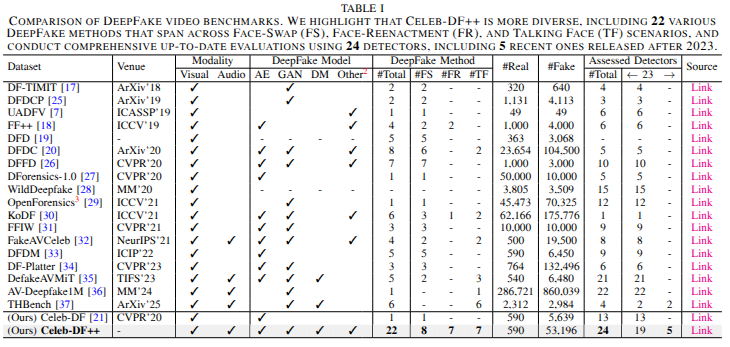

<h1 align="center">Celeb-DF++: A Large-scale Challenging Video DeepFake Benchmark for Generalizable Forensics</h1>

<div align='center'>
    <a href='https://yuezunli.github.io/' target='_blank'><strong>Yuezun Li</strong></a><sup> 1*</sup>&emsp;
    <a href='https://hisssec.github.io/' target='_blank'><strong>Delong Zhu</strong></a><sup> 1</sup>&emsp;
    <a target='_blank'><strong>Xinjie Cui</strong></a><sup> 1</sup>&emsp;
    <a target='_blank'><strong>Siwei Lyu</strong></a><sup> 2</sup>&emsp;
</div>

<!-- <div align='center'>
    <a target='_blank'><strong>Zhibo Wang</strong></a><sup> 3</sup>&emsp;
    <a target='_blank'><strong>Siwei Lyu</strong></a><sup> 4</sup>&emsp;
</div>-->

<div align='center'>
    <sup>1 </sup>Ocean University of China&emsp; <sup>2 </sup>University at Buffalo SUNY&emsp;
</div>
<div align='center'>
    <small><sup>*</sup> Corresponding author</small>
</div>
<br>

<div align="center">
  <!-- <a href='LICENSE'></a> -->
    <a href='https://openaccess.thecvf.com/content_CVPR_2020/papers/Li_Celeb-DF_A_Large-Scale_Challenging_Dataset_for_DeepFake_Forensics_CVPR_2020_paper.pdf'></a>
  <a href='https://arxiv.org/pdf/2412.01101'></a>
  <a href='https://github.com/OUC-VAS/Celeb-DF-PP/releases'></a>
  <!--<a href="https://github.com/KwaiVGI/LivePortrait"></a> -->
  <br>

</div>
<br>


<p align="center">
  
  <br>

</p>

## Updates 🔥 
 - We released the **Celeb-DF++ (v3)** dataset 💪
 - We released the official version of **[Celeb-DF (v2)](https://github.com/yuezunli/celeb-deepfakeforensics)** dataset ✨
 - We released the preview version of **[Celeb-DF (v1)](https://github.com/yuezunli/celeb-deepfakeforensics/blob/master/Celeb-DF-v1/README.md)** dataset 😊


## Introduction 📖
**Celeb-DF++** is extended from our previous **Celeb-DF** dataset with more diversity, including **22** various DeepFake methods that span across **Face-swap (FS)**, **Face-reenactment (FR)**, and **Talking-face (TF)** scenarios. Moreover, we conduct comprehensive up-to-date evaluations using **24** detectors, including 5 recent ones released after 2023 that have not been considered in existing datasets.

This repo contains the official PyTorch implementation of our paper [Celeb-DF++: A Large-scale Challenging Video DeepFake Benchmark for Generalizable Forensics](https://arxiv.org/pdf/2412.01101).
We are actively updating and improving this repository. If you find any bugs or have suggestions, welcome to raise issues or submit pull requests (PR). 💖

## Download 📥
xxxxxxx

## Dataset Structure 📂
```
Celeb-DF++
├──Celeb-real
├──YouTube-real
├──Celeb-synthesis
│       ├── FaceSwap
│       │       ├── Celeb-DF-v2
│       │       ├── BlendFace
│       │       ├── GHOST
│       │       ├── HifiFace
│       │       ├── InSwapper
│       │       ├── MobileFaceSwap
│       │       ├── SimSwap
│       │       └── UniFace
│       ├── FaceReenact
│       │       ├── DaGAN
│       │       ├── FSRT
│       │       ├── HyperReenact
│       │       ├── LIA
│       │       ├── LivePortrait
│       │       ├── MCNET
│       │       └── TPSMM
│       └── TalkingFace
│               ├── AniTalker
│               ├── EchoMimic
│               ├── EDTalk
│               ├── FLOAT
│               ├── IP_LAP
│               ├── Real3DPortrait
│               └── SadTalker
└──List_of_testing_videos.txt
```

## Training and Testing Split ✂️

> [!IMPORTANT]
> - For the **Highlighting the Increased Challenge**, the real video samples are replicated 22 times—corresponding to the 22 DeepFake methods—and then combined with the DeepFake samples.
> - For the **Protocol #3 (GFD-eval)**, each DeepFake method is independently paired with its corresponding real videos for testing.

For real videos, we follow the split of Celeb-DF, where 178 videos are selected. For DeepFake videos, we randomly select 200 videos per method in the Face-swap scenario, 200 videos per method in the Face-reenactment scenario, and 300 videos per method in the Talking-face scenario, respectively. The test set loading strategy remains consistent with Celeb-DF and can be implemented using the `List_of_testing_videos.txt` file.

## Getting Started 🏁
> [!NOTE]
> - Most of the methods are implemented following the default settings and pre-processing procedures in **[DeepfakeBench](https://github.com/SCLBD/DeepfakeBench)**. We also provide our retrained but unpublished **[pre-trained weights](https://github.com/OUC-VAS/Celeb-DF-PP/releases)** of DeepFakeBench to facilitate evaluation and testing.
> - **Celeb-DF++** is implemented within the framework of DeepfakeBench. The provided code should be placed in the corresponding folders of DeepFakeBench, replacing the original files as needed, and test/train on DeepfakeBench as well.

## Comparison of DeepFake Video Benchmarks ⚔️
<p align="center">
  
  <br>

</p>

## Privacy Statement 🛡️

This dataset  follow ethical guidelines, which is provided "as it is" and we are not responsible for any subsequence from using this dataset. All original videos of the Celeb-DF++ dataset are obtained from the Internet which are not property of the authors or the authors’ affiliated institutions. Neither the authors or the authors’ affiliated institution are responsible for the content nor the meaning of these videos. If you feel uncomfortable about your identity shown in this dataset, please contact us and we will remove corresponding information from the dataset.

## Acknowledgements 💐
We would like to thank the contributors of [DeepfakeBench](https://github.com/SCLBD/DeepfakeBench), [ForensicsAdapter](https://github.com/OUC-VAS/ForensicsAdapter), [Effort](https://github.com/YZY-stack/Effort-AIGI-Detection), [ProDet](https://github.com/beautyremain/ProDet) and all related repositories, for their open research and contributions.

## Citation 💖
If you find Celeb-DF++ useful for your research, welcome to 🌟 this repo and cite our work using the following BibTeX:
```bibtex
@article{xxx,
  title={Celeb-DF++: A Large-scale Challenging Video DeepFake Benchmark for Generalizable Forensics},
  author={Li, Yuezun and Zhu, Delong and Cui, Xinjie and Lyu, Siwei},
  journal={arXiv preprint arXiv:xxx},
  year={2025}
}

@inproceedings{li2020celeb,
  title={Celeb-df: A large-scale challenging dataset for deepfake forensics},
  author={Li, Yuezun and Yang, Xin and Sun, Pu and Qi, Honggang and Lyu, Siwei},
  booktitle={IEEE Conference on Computer Vision and Pattern Recognition},
  year={2020}
}
```
## Contact 📧
[**Yuezun Li**](https://yuezunli.github.io/); **liyuezun@ouc.edu.cn**<br>
[**Delong Zhu**](https://hisssec.github.io/); **zhudelong@stu.ouc.edu.cn**
