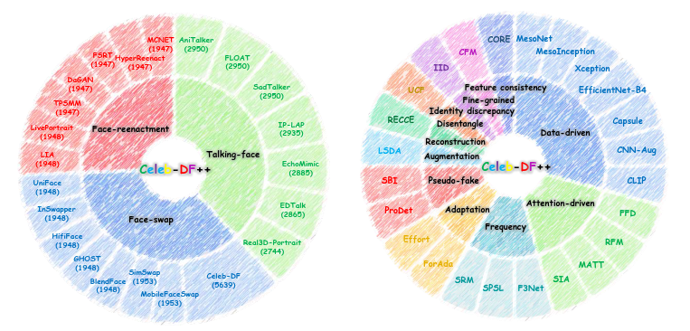

<h1 align="center">Celeb-DF++: A Large-scale Challenging Video DeepFake Benchmark for Generalizable Forensics</h1>

<div align='center'>
    <a href='https://yuezunli.github.io/' target='_blank'><strong>Yuezun Li</strong></a><sup> 1</sup> (✉️)&emsp;
    <a href='https://hisssec.github.io/' target'_blank'><strong>Delong Zhu</strong></a><sup> 1</sup>&emsp;
   <strong>Xinjie Cui</strong></a><sup> 1</sup>&emsp;
  <strong>Siwei Lyu</strong></a><sup> 2</sup>&emsp;
</div>
<div align='center'>
    <sup>1 </sup>Ocean University of China&emsp; <sup>2 </sup>University at Buffalo SUNY&emsp;
</div>
<div align='center'>
    <a href="https://arxiv.org/pdf/2507.18015">[Paper]</a> &nbsp
    <a href="#download">[Download]</a> &nbsp
    <a href="#dataset-structure">[Data Structure]</a> &nbsp
    <a href="#visual-examples">[Visual Examples]</a> &nbsp
    <a href="#citation">[Citation]</a>
</div>

<p align="center">
  
</p>


## Introduction 

We introduce **Celeb-DF++** for addressing a pratical and urgent challenge for DeepFake detection, referred to as **Generalizable forensics**, i.e., detecting a wide range of unseen DeepFake types using a single model.
<p align="center">
  
</p>

 Celeb-DF++ is extended from our earlier [Celeb-DF (CVPR'20)](https://github.com/yuezunli/celeb-deepfakeforensics) dataset with significantly more diversity, including **22** various DeepFake methods that span across three commonly witnessed scenarios: 
- **Face-swap (FS)** represents that the face of a source individual is replaced with a synthesized face of a target individual, while retaining consistent facial attributions.
- **Face-reenactment (FR)** involves generating new videos of a target individual driven by the behaviors of a source individual, ensuring behavioral consistency.
- **Talking-face (TF)** leverages audio input to generate synchronized lip movements in synthesized videos of the target individuals.

To comprehensively measure the generalizability of DeepFake detection methods, we establish three challenging evaluation protocols: 
- **Generalized Forgery evaluation (GF-eval)** assesses detection performance across DeepFake methods in all three forgery scenarios, reflecting real-world conditions where forgeries are diverse and potentially unseen
- **Generalized Forgery across Quality evaluation (GFQ-eval)** increases the challenge by evaluating the detection performance under varying video compression levels. This aligns with the reality that online videos are often subject to compression, and this compression can obscure forgery traces, raising the challenge for generalizable forensics. 
- **Generalized Forgery across Datasets evaluation (GFD-eval)** measures the generalizability of detection methods across different datasets, simulating the practical case where training and testing data originate from different sources.

With these evaluation protocols, we conduct comprehensive up-to-date evaluations using **24** recent detectors (including 5 recent ones released after 2024). 


## Download 
If you would like to access the Celeb-DF++ dataset, please fill out this [form](https://wj.qq.com/s2/23258268/2516/). Once your request is approved, a download link will be provided. For any questions, please contact us at liyuezun@ouc.edu.cn.


## Dataset Structure 
```
Celeb-DF++
├──Celeb-real
├──YouTube-real
├──Celeb-synthesis
│       ├── FaceSwap
│       │       ├── Celeb-DF (original DeepFake videos in Celeb-DF)
│       │       ├── BlendFace
│       │       ├── GHOST
│       │       ├── HifiFace
│       │       ├── InSwapper
│       │       ├── MobileFaceSwap
│       │       ├── SimSwap
│       │       └── UniFace
│       ├── FaceReenact
│       │       ├── DaGAN
│       │       ├── FSRT
│       │       ├── HyperReenact
│       │       ├── LIA
│       │       ├── LivePortrait
│       │       ├── MCNET
│       │       └── TPSMM
│       └── TalkingFace
│               ├── AniTalker
│               ├── EchoMimic
│               ├── EDTalk
│               ├── FLOAT
│               ├── IP_LAP
│               ├── Real3DPortrait
│               └── SadTalker
└──List_of_testing_videos.txt
```
## Visual Examples

<p align="center">
  
</p>
Visual examples of Celeb-DF++. The first column denotes the source identity face and the bottom-left embedded image represents
the target face or the driving face/audio. The remaining columns display the results generated by each DeepFake method.

## Training and Testing Split 
For real testing videos, we follow the split of Celeb-DF, where 178 videos are selected. For DeepFake testing videos, we randomly select 200 videos per method in the Face-swap scenario, 200 videos per method in the Face-reenactment scenario, and 300 videos per method in the Talking-face scenario, respectively. The split details can be found in `List_of_testing_videos.txt`.


## Citation 
If you find this dataset useful for your research, welcome to star this repo and cite our work using the following BibTeX:
```bibtex
@article{li2025celebpp,
  title={Celeb-DF++: A Large-scale Challenging Video DeepFake Benchmark for Generalizable Forensics},
  author={Li, Yuezun and Zhu, Delong and Cui, Xinjie and Lyu, Siwei},
  journal={arXiv preprint arXiv:xxx},
  year={2025}
}

@inproceedings{li2020celeb,
  title={Celeb-DF: A Large-scale Challenging Dataset for Deepfake Forensics},
  author={Li, Yuezun and Yang, Xin and Sun, Pu and Qi, Honggang and Lyu, Siwei},
  booktitle={IEEE Conference on Computer Vision and Pattern Recognition},
  year={2020}
}
```

## Privacy Statement
This dataset is released under the [Terms to Use Celeb-DF++](https://wj.qq.com/s2/23258268/2516/), which is provided "as it is" and we are not responsible for any subsequence from using this dataset. All original videos of the Celeb-DF dataset are obtained from the Internet which are not property of the authors or the authors’ affiliated institutions. Neither the authors or the authors’ affiliated institution are responsible for the content nor the meaning of these videos. If you feel uncomfortable about your identity shown in this dataset, please contact us and we will remove corresponding information from the dataset.


## Acknowledgements 
We would like to thank the contributors of [DeepfakeBench](https://github.com/SCLBD/DeepfakeBench), [ForensicsAdapter](https://github.com/OUC-VAS/ForensicsAdapter), [Effort](https://github.com/YZY-stack/Effort-AIGI-Detection), [ProDet](https://github.com/beautyremain/ProDet) and all related repositories, for their open research and contributions.

## Contact 
[Yuezun Li](https://yuezunli.github.io/) (liyuezun@ouc.edu.cn);<br>
[Delong Zhu](https://hisssec.github.io/) (zhudelong@stu.ouc.edu.cn)
